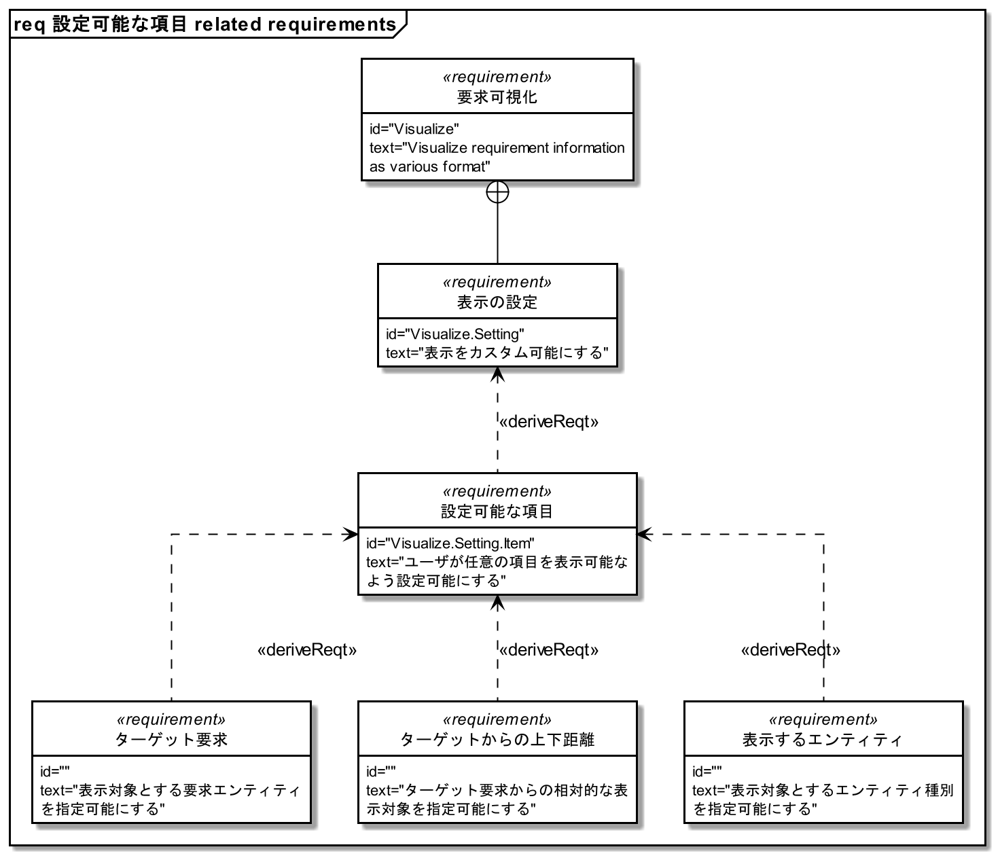
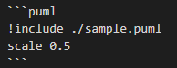

# SimpleRequirementDiagram
JSON形式で記述された要求情報を、PlantUMLのクラス図を利用してSysMLの要求図ライクなフォーマットで出力します。

## 要求情報(JSONファイル)
要求情報は、以下の情報のリストとして構成されます。  
`sample/requirements.json`が記述のサンプルになっていますので、必要に応じて参照してください。

|キー|値フォーマット|可能な値|説明|
|:--:|:--:|--|--|
|type|string|usecase requirement block rationale problem|要求図のモデル要素を指定します。|
|id|string|Any|モデル要素のID|
|title|string|Any|モデル要素のタイトル(*1)|
|text|string|Any|モデル要素の説明(*1)|
|unique_id|string|Any|モデル要素を一意に表す文字列(*2)|
|relations|list|-|モデル要素間の接続関係を表す 下記kind, to, noteのみもつことが可能|
|kind|string|refine deriveReqt contains satisfy None|モデル要素間の接続関係を表す Noneはrationale, problemのみ可能|
|to|string|Any|モデル要素の接続先を指定する unique_idのみ指定可能|
|note|string|Any|モデル要素間の接続に対してrationaleまたはproblemのモデル要素を関連付ける rationale, problemのunique_idのみ指定可能|

(*1) markdown形式のリンク文字列`[string](link)`が使用可能  
(*2) 後述するVSCodeのスニペットで入力可能

### VSCodeスニペット
要求情報の入力を補助するためのスニペットを`json_snippet.json`に格納しています。  
jsonファイルへのユーザスニペットとしてコピー&ペーストしてください。  
以下の入力を行います。

|名称|ショートカット|説明|
|--|--|--|
|Add new requirement|a|relations以外の要求情報テンプレートを出力します unique_idとして、現在日時が自動的に入力されます|
|Add datetime as unique id|u|現在日時を出力します unique_idのみを更新する場合に利用します|
|Add new relation|r|relasionsのリストに格納する接続関係情報テンプレートを出力します|

## 要求図出力
`make_requirement_diagram.py`を実行すると、PlantUML用のコードファイルが出力されます。  
以下のオプションが利用可能です。

|オプション|利用例|デフォルト値|説明|
|--|--|--|--|
|-r --req|-r ./sample/requirements.json|なし|読み込み対象とする要求情報ファイルを指定します|
|-t --target|-t 20220918_133643|なし|要求図の起点とする要求のunique_id, タイトルまたはidを指定します|
|-u --upper|-u 3|100|-tで指定した起点とする要求から、上流に遡って表示するレベルを指定します|
|-l --lower|-l 3|100|-tで指定した起点とする要求から、下流に下って表示するレベルを指定します|
|-ti --title|-ti "サンプル"|"-tで指定した要素のタイトル related requirements"|要求図のタイトルを指定します|
|-d --detail|-d|なし|指定すると要求図をtext要素を含めた詳細形式で出力します 指定されない場合、要求図はIDとタイトルのみの簡易形式となります|
|-w --width|-w 24|24|モデルにおいて1行に表示するおおよその文字数を指定します 文字列に空白を含まない場合、指定した2/3の値が設定されます|
|-o --output|-o ./sample.puml|./sample.puml|PlantUML用のコードファイルの出力パスを指定します|
|--help|--help|なし|オプションのヘルプを表示します|

### プレビュー
拡張機能[Markdown Preview Enhanced](https://marketplace.visualstudio.com/items?itemName=shd101wyy.markdown-preview-enhanced)がインストールされている場合は、適当なmarkdownファイルに以下のように記述しておくことで出力結果を確認できます。  

